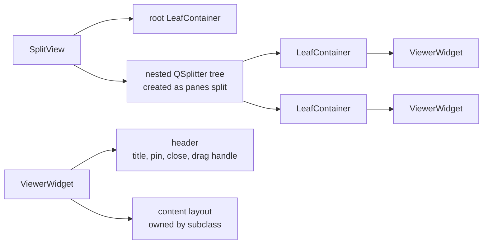
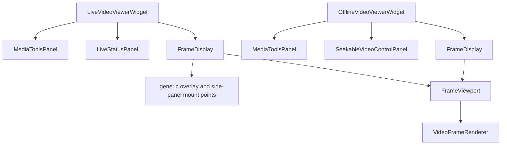

# UI Framework Structure

This document maps the current UI framework layer (code in `modules/workspace/ui/`; see [Workspace](workspace.md) for the `core`/`ui` split): windows, dialogs, Workspace composition, viewer hosting, and the display stack.

## Top-Level Composition

```mermaid
flowchart TD
    App["Application / app.py"] --> MainWindow["MainWindow<br/>ChromeWindow"]
    MainWindow --> MenuHost["menu_host()<br/>TitleBar menu bar or native QMenuBar"]
    MainWindow --> WorkspaceSession["WorkspaceSession"]
    MainWindow --> Dialogs["BaseDialog subclasses<br/>add video, live stream, playlist, settings, shortcuts, about"]
    MainWindow --> DebugWindows["DebugWindow / PluginWindow"]

    WorkspaceSession --> WorkspaceStore["WorkspaceStore<br/>items, resolved Content, signals"]
    WorkspaceSession --> WorkspaceLifecycle["WorkspaceLifecycle<br/>launch, quit, new, open, save"]
    WorkspaceLifecycle --> WorkspaceStore
    WorkspaceSession --> ApplicationWindow["ApplicationWindow<br/>central widget"]
    WorkspaceSession --> WorkspaceController["WorkspaceController<br/>UI coordinator"]
    WorkspaceSession --> ContentBrowser["ContentBrowserWidget<br/>workspace tree"]

    ApplicationWindow --> ActivityBar["ActivityBar<br/>left-edge icon strip"]
    ApplicationWindow --> HorizontalSplitter["QSplitter<br/>sidebar + center"]
    HorizontalSplitter --> SidebarPanel["SidebarPanel<br/>start panel or content tree"]
    SidebarPanel --> StartPanel["StartPanel<br/>open actions, recent workspaces"]
    SidebarPanel --> ContentBrowser
    HorizontalSplitter --> SplitView["SplitView<br/>viewer widget host"]

    WorkspaceController --> SplitView
    WorkspaceController --> WorkspaceStore
    WorkspaceController --> ContentBrowser

    SplitView --> LeafContainer["LeafContainer<br/>one viewer widget per leaf"]
    LeafContainer --> ViewerWidget["ViewerWidget<br/>base class"]
    ViewerWidget --> LiveViewer["LiveVideoViewerWidget"]
    ViewerWidget --> OfflineViewer["OfflineVideoViewerWidget"]

    LiveViewer --> LiveDisplay["FrameDisplay"]
    OfflineViewer --> OfflineDisplay["FrameDisplay"]
    OfflineViewer --> SeekControls["SeekableVideoControlPanel"]
    LiveDisplay --> FrameViewport
    OfflineDisplay --> FrameViewport
    FrameViewport --> Renderer["VideoFrameRenderer"]
```

## Window Layer

`MainWindow` lives in `ax_devil.modules.application_shell`. It inherits from `ChromeWindow`, owns `WorkspaceSession`, installs shortcuts, creates menus, opens application dialogs, and hosts the session's `ApplicationWindow` as its central widget.

`ChromeWindow` and `BaseDialog` live in `ax_devil.modules.chrome`. With custom chrome enabled they install a shared `TitleBar` and `WindowFrameController`. `ChromeWindow.menu_host()` returns the title bar's menu bar or, with custom chrome disabled, the native `QMenuBar`; dialogs have no menu host and inherit custom-frame behavior from their parent top-level window. Their rules are in the [chrome README](../../src/ax_devil/modules/chrome/README.md).

## Workspace Shell

`WorkspaceSession` is the public Workspace facade and creates and wires the framework-level Workspace objects:

- `ItemResolver` and `WorkspaceStore`
- `WorkspaceLifecycle`
- `ContentBrowserWidget`
- `SplitView`
- `ApplicationWindow`
- `WorkspaceController`

Callers use the session to add Workspace Items (`add_items`, `add_resolved`, `open_files`), reach the workspace
lifecycle (`session.lifecycle`), route to the focused widget, configure welcome shortcuts, and tear down. The lifecycle
— the kept workspace, the Save / Discard / Cancel question, and recent workspaces — is described in
[Workspace](workspace.md#lifecycle). The session re-emits the store's
`state_changed`, and `MainWindow` sets its title from `workspace_name` and `is_modified`; the custom `TitleBar` follows
the window title. The store, browser, split view, and controller are composed implementation details rather than
separate session APIs.

`ApplicationWindow` is the static central shell. It lays out the `ActivityBar`, the `SidebarPanel`, and `SplitView` in the center area. It owns only whether the sidebar shows and how wide it is, not workspace state, teardown, or viewer behavior. The sidebar shows unless the user hid it with **View → Sidebar** (`Ctrl+\`), the activity bar's Workspace button, or by dragging it closed; it always appears at the width the user last dragged it to. `SidebarPanel` shows the `StartPanel` while the content browser lists nothing, and the content browser otherwise. It accepts desktop file drags that contain a video and emits `files_dropped`; the session pairs the files into `VideoFileSelection`s, turns them into Video Items, and asks for the data handler in a prefilled Add Video dialog only when several decoders may read the overlay. Pane drags carry their own MIME type and are accepted by `LeafContainer` before they reach this widget.

`WelcomeWidget`, shown by `SplitView` while no widgets are open, paints clickable rows. Shortcut rows come from `ShortcutManager` definitions marked `show_on_welcome` and trigger the same `QAction` as the menu and key binding; recent rows show a workspace file's name, with its path as tooltip, and emit `recent_workspace_requested`.
The welcome screen scrolls when its rows cannot fit, keeping its actions reachable in small windows.

## Workspace Controller

`WorkspaceController` coordinates UI behavior between `ContentBrowserWidget`, `WorkspaceStore`, `SplitView`, and open `ViewerWidget` instances.

It owns browser synchronization: Workspace mutations refresh the browser rows projected by `build_browser_rows` (`workspace/ui/browser_rows.py`), and browser intents are routed back to Workspace state or viewer behavior.

Opening from the browser has two placements: replace the preview pane (`SplitView.replace_or_open`) or split the
focused pane and open pinned (`SplitView.open_to_side`).

Top-level browser rows are one per Content, or one unavailable row for an item that failed to resolve. **Rename** and
**Remove** act on the whole item, and a rename calls `ViewerWidget.set_display_name` on open viewers showing that Content, and offline viewers relabel
their render diagnostics with it.

Responsibilities:

- Open `SeekableVideoContent`, `LiveVideoContent`, or `PlaylistContent` through `WorkspaceViewerFactory`, placing the
  viewer in the preview pane or in a new split as the browser intent requests.
- Register which item each viewer widget's Content came from.
- Project each widget's current on-screen item into browser rows.
- Remove or rename the item a browser row asks for, and close every widget of a removed item.
- Tell the user which newly added items could not resolve, and why.
- Notify open viewers when consideration state changes.

Workspace content defines which entries and lanes support consideration. Offline viewer navigation reads that state through the narrow `ConsiderationQuery` contract; it does not depend on the mutable `WorkspaceStore` implementation.

`SplitView` is the visual container. `WorkspaceController` owns viewer selection, registration, and state coordination.

## Center Area

`SplitView` owns nested splitter structure, drag/drop splitting, focused widget tracking, and removal/collapse behavior.

Each `LeafContainer` hosts at most one `ViewerWidget`. Dragging starts from `ViewerWidget.get_header_widget()`. Dropping onto a leaf asks `SplitView` to move the widget there, splitting the leaf when it is occupied.

Unpinned panes are previews: their header title is italic, and `replace_or_open` replaces the first one with newly
opened content. Pinned panes keep a regular title and are never replaced; when every pane is pinned, new content opens
in a new split. `open_to_side` always adds a pinned pane to the right of the focused pane.

Framework-level signals:

- `widget_removed`

## Viewer Widget Contract

`ViewerWidget` is the base class for widgets hosted by `SplitView`.

It provides:

- header with display name
- pin and close icon buttons; an italic title marks an unpinned preview pane
- content layout for subclasses
- close routing through `close_requested`
- current item reporting through `current_on_screen_item()`
- consideration refresh hook through `refresh_item_consideration()`
- `cleanup()` hook, overridden by widgets that own runtime resources

Current concrete viewer widgets:

- `LiveVideoViewerWidget`: one `LiveVideoContent`; composes `FrameDisplay`, live status UI, `MediaToolsPanel`, and `StreamMediaController`.
- `OfflineVideoViewerWidget`: `SeekableVideoContent` or `PlaylistContent`; opens entries in the background through `EntryOpening` and builds active entry runtimes through `OfflineSession`.

## Display Stack

`FrameDisplay` is the public reusable display shell. It owns a `FrameViewport`, forwards frame/overlay display and viewport state, and provides generic mount points for caller-owned widgets such as status overlays or side-panel tools. It does not own media sources, synchronization, Scene tools, live status semantics, or workflow actions.

`FrameViewport` is the lower-level viewing area. It extends `VideoFrameRenderer` with background/HUD painting, interactive viewport behavior, hover reporting, and visual widget-overlay positioning.

`VideoFrameRenderer` owns frame preparation and prepared-drawing submission.

Each lane's media tools live in its display's side panel. View-menu actions such as the media tools toggle and zoom
route to the focused viewer through `ViewerWidget` methods; shortcuts marked `acts_on_viewer` on their
`ShortcutDefinition` also work from lane fullscreen. Which lane an offline session targets is a
[viewer rule](../../src/ax_devil/modules/video_viewer/README.md#rules).

An overlay mounted on `FrameDisplay` with `preference` or `hide_while_inspecting` hands its visibility to
`FrameViewport`, which hides it while that `OverlayPreference` is off, or while the frame is zoomed in or showing
info, respectively.

## Ownership Boundaries

- `MainWindow` owns application-wide actions, menus, shortcuts, dialogs, diagnostics windows, and the `WorkspaceSession`.
- `WorkspaceSession` owns Workspace composition, adding items, focused-viewer lookup, and teardown.
- `WorkspaceLifecycle` owns the workspace file lifecycle; it builds no widgets.
- `ApplicationWindow` owns the static central layout.
- `WorkspaceController` owns browser synchronization, UI coordination, viewer-to-item tracking, and lifecycle side effects.
- `SplitView` owns pane layout, focused viewer widget tracking, drag/drop splitting, and widget removal mechanics.
- `ViewerWidget` owns the common pane frame and lifecycle contract.
- Video Viewer workflows own media orchestration, playlist navigation, comparison layout, filtering tools, and workflow actions.
- `FrameDisplay` and `FrameViewport` own reusable display and viewport concerns.
- `VideoFrameRenderer` owns actual painting.

## Extension Points

- New center-pane tools should inherit from `ViewerWidget`, implement `get_display_name()` and `_setup_widget_ui()`, emit `on_screen_item_changed` when visible Workspace content changes, and override `cleanup()` if they own resources.
- New viewer widgets should be opened through `WorkspaceController`.
