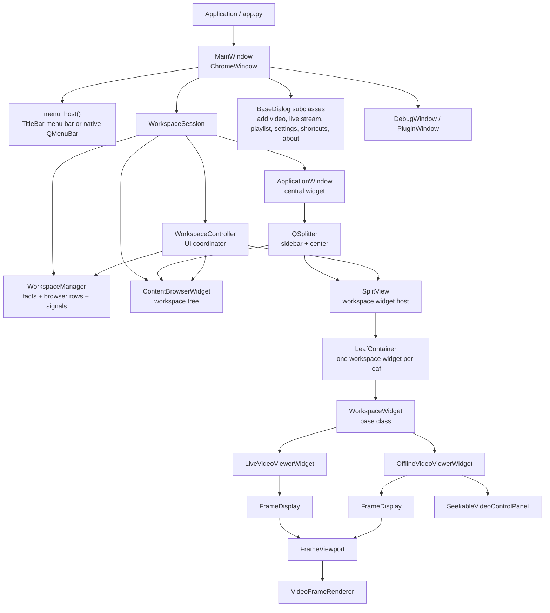
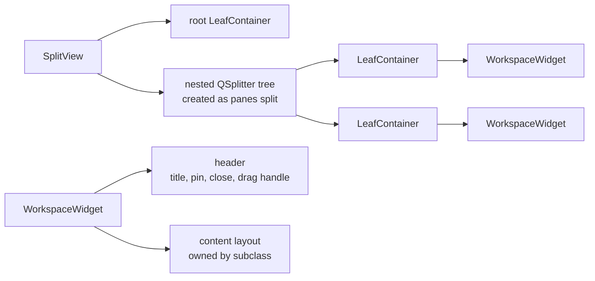
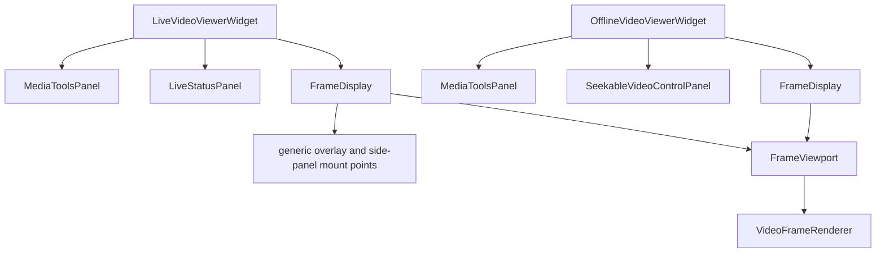

# UI Framework Structure

This document maps the current UI framework layer: windows, dialogs, Workspace composition, viewer hosting, and the display stack.

## Top-Level Composition

## Window Layer

`MainWindow` lives in `ax_devil.modules.application_shell`. It inherits from `ChromeWindow`, owns `WorkspaceSession`, installs shortcuts, creates menus, opens application dialogs, and hosts the session's `ApplicationWindow` as its central widget.

`ChromeWindow` lives in `ax_devil.modules.chrome`. When custom chrome is enabled, it installs a shared `TitleBar` as the menu widget and delegates frameless resize/window-state behavior to `WindowFrameController`. When custom chrome is disabled, callers use the native `QMenuBar` through the same `menu_host()` API. `ChromeWindow` callers pass an explicit `use_custom_frame` boolean; use `window_uses_custom_frame()` from the same module when a child window should match its parent. The main application window disables the custom-frame border, while secondary custom-framed windows use the controller-owned one-pixel inside border.

`BaseDialog` is the shared `QDialog` base. Dialogs inherit custom-frame behavior from their parent top-level window, create a common content area and button row, and use the same title-bar/frame-controller path when frameless mode is active. The content area scrolls by default and always fills the dialog, so stretch-1 children take spare height; dialogs built around their own scrolling list, such as Keyboard Shortcuts and Settings, pass `scroll_content=False`.

## Workspace Shell

`WorkspaceSession` is the public Workspace facade and creates and wires the framework-level Workspace objects:

- `WorkspaceManager`
- `ContentBrowserWidget`
- `SplitView`
- `ApplicationWindow`
- `WorkspaceController`

Callers use the session for content mutation, startup loading, opening video requests (`open_video`, `open_files`),
focused-widget routing, welcome-shortcut configuration, and teardown. Every video opened through `open_video` is recorded
in `RecentVideos`, a small JSON list in the storage directory that the welcome screen shows under **Recent**. Stored paths
are absolute so reopening a selection is independent of the next launch's working directory. The manager, browser,
split view, and controller are composed implementation details rather than separate session APIs.

`ApplicationWindow` is the static central shell. It lays out `ContentBrowserWidget` in the left sidebar and `SplitView` in the center area. It owns only whether the sidebar shows and how wide it is, not workspace state, teardown, or viewer behavior. The sidebar shows while the workspace has content and the user has not hidden it with **View → Sidebar** (`Ctrl+\`) or dragged it closed; it always appears at the width the user last dragged it to. It accepts desktop file drags that contain a video and emits `files_dropped`; the session pairs the files into `VideoFileStartup` requests and asks for the data handler in a prefilled Add Video dialog only when several decoders may read the overlay. Pane drags carry their own MIME type and are accepted by `LeafContainer` before they reach this widget.

`WelcomeWidget`, shown by `SplitView` while no widgets are open, paints clickable rows. Shortcut rows come from `ShortcutManager` definitions marked `show_on_welcome` and trigger the same `QAction` as the menu and key binding; recent rows take their label from `VideoFileStartup.label` and emit `recent_video_requested`.
The welcome screen scrolls when its rows cannot fit, keeping actions and recent videos reachable in small windows.

## Workspace Controller

`WorkspaceController` coordinates UI behavior between `ContentBrowserWidget`, `WorkspaceManager`, `SplitView`, and open `WorkspaceWidget` instances.

It owns browser synchronization: Workspace mutations refresh the derived browser rows, and browser intents are routed back to Workspace state or viewer behavior.

Browser rows carry stable IDs based on content identity and entry/lane indices. Refreshes preserve
expanded and collapsed branches by ID; newly opened rows and search matches still expand. Labels and
row positions are not identities. Filtering reads the projected consideration state, not button state.
The row eye includes/excludes an item from playback layout/navigation; the toolbar funnel only shows/hides
excluded items in the browser list, so the two controls use different icons and tooltips. Context menus and
information dialogs are disposed after closing.

Rows render `WorkspaceBrowserRow.display_text` with middle elision, so file extensions stay visible in a narrow
sidebar. When sibling rows share a label, `WorkspaceManager` adds the shortest location hint that tells their sources
apart, or numbers them; the tooltip shows the full source location, and search matches the displayed text including
the hint.

Opening from the browser has two placements. Double-click and **Open** replace the preview pane through
`SplitView.replace_or_open`. Ctrl+double-click and **Open to the Side** call `SplitView.open_to_side`, which splits
the focused pane and opens the new viewer pinned, so no existing pane is replaced.

Responsibilities:

- Open `SeekableVideoContent`, `LiveVideoContent`, or `PlaylistContent` through `WorkspaceViewerFactory`, placing the
  viewer in the preview pane or in a new split as the browser intent requests.
- Register which workspace widgets depend on which content.
- Project each widget's current on-screen item into browser rows.
- Close affected widgets when backing content is removed.
- Clear all viewers when the workspace is cleared.
- Notify open viewers when consideration state changes.

Workspace content defines which entries and lanes support consideration. Offline viewer navigation reads that state through the narrow `ConsiderationQuery` contract; it does not depend on the mutable `WorkspaceManager` implementation.

`SplitView` is the visual container. `WorkspaceController` owns viewer selection, registration, and state coordination.

## Center Area

`SplitView` owns nested splitter structure, drag/drop splitting, focused widget tracking, and removal/collapse behavior.

Each `LeafContainer` hosts at most one `WorkspaceWidget`. Dragging starts from `WorkspaceWidget.get_header_widget()`. Dropping onto a leaf asks `SplitView` to split that leaf and move or insert the widget.

Unpinned panes are previews: their header title is italic, and `replace_or_open` replaces the first one with newly
opened content. Pinned panes keep a regular title and are never replaced; when every pane is pinned, new content opens
in a new split. `open_to_side` always adds a pinned pane to the right of the focused pane.

Framework-level signals:

- `widget_removed`

## Workspace Widget Contract

`WorkspaceWidget` is the base class for widgets hosted by `SplitView`.

It provides:

- header with display name
- pin and close icon buttons with 24 px click targets; an italic title marks an unpinned preview pane
- content layout for subclasses
- close routing through `close_requested`
- current item reporting through `current_on_screen_item()`
- consideration refresh hook through `refresh_item_consideration()`
- required `cleanup()` hook

Current concrete workspace widgets:

- `LiveVideoViewerWidget`: one `LiveVideoContent`; composes `FrameDisplay`, live status UI, `MediaToolsPanel`, and `StreamMediaController`.
- `OfflineVideoViewerWidget`: `SeekableVideoContent` or `PlaylistContent`; opens entries in the background through `EntryOpening` and builds active entry runtimes through `OfflineSession`.

## Display Stack

`FrameDisplay` is the public reusable display shell. It owns a `FrameViewport`, forwards frame/overlay display and viewport state, and provides generic mount points for caller-owned widgets such as status overlays or side-panel tools. It does not own media sources, synchronization, Scene tools, live status semantics, or workflow actions.

`FrameViewport` is the lower-level viewing area. It extends `VideoFrameRenderer` with background/HUD painting, interactive viewport behavior, hover reporting, and visual widget-overlay positioning.

`VideoFrameRenderer` owns frame preparation and prepared-drawing submission.

Each lane's media tools live in its display's side panel. **View → Media Tools Panel** (`Ctrl+B`) routes to the
focused viewer through `WorkspaceWidget.toggle_media_tools()`; an offline session toggles only the lane containing
keyboard focus, or the first lane when focus is outside its displays. Every viewer, and every playlist entry, starts
with the media tools closed. The drag handle on the right edge of the video opens, resizes or closes one lane's panel.

**View → Zoom In / Zoom Out / Reset Zoom** (`Ctrl++`, `Ctrl+-`, `Ctrl+0`) route to the focused viewer through
`WorkspaceWidget.zoom(ZoomStep)` and zoom around the view center. An offline session uses the lane containing
keyboard focus, including in lane fullscreen, or the first lane when focus is outside its displays; other lanes
follow through viewport sync. Shortcuts marked `acts_on_viewer` on their `ShortcutDefinition` also work from lane fullscreen.

On/off overlay preferences are `OverlayPreference` members, which own their labels; the View menu and Settings both
list them, and a menu toggle saves through `save_overlay_preference`. An overlay mounted with `preference` or
`hide_while_inspecting` hands its visibility to `FrameViewport`, which hides it while that preference is off, or
while the frame is zoomed in or showing info.

## Ownership Boundaries

- `MainWindow` owns application-wide actions, menus, shortcuts, dialogs, diagnostics windows, and the `WorkspaceSession`.
- `WorkspaceSession` owns Workspace composition, startup loading, focused-viewer lookup, and teardown.
- `ApplicationWindow` owns the static central layout.
- `WorkspaceController` owns browser synchronization, UI coordination, viewer dependency tracking, and lifecycle side effects.
- `SplitView` owns pane layout, focused workspace widget tracking, drag/drop splitting, and widget removal mechanics.
- `WorkspaceWidget` owns the common pane frame and lifecycle contract.
- Video Viewer workflows own media orchestration, playlist navigation, comparison layout, filtering tools, and workflow actions.
- `FrameDisplay` and `FrameViewport` own reusable display and viewport concerns.
- `VideoFrameRenderer` owns actual painting.

## Extension Points

- New center-pane tools should inherit from `WorkspaceWidget`, implement `get_display_name()` and `_setup_widget_ui()`, emit `on_screen_item_changed` when visible Workspace content changes, and implement `cleanup()`.
- New viewer widgets should be opened through `WorkspaceController`.
